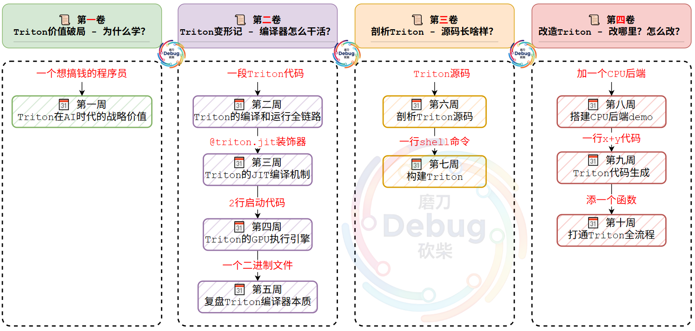
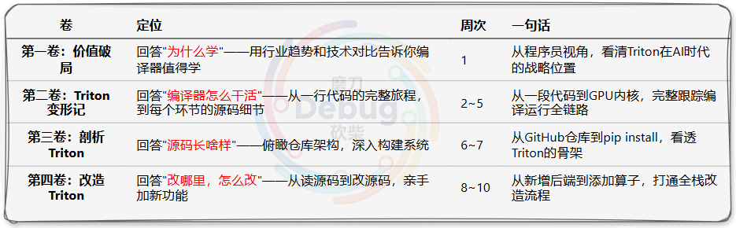
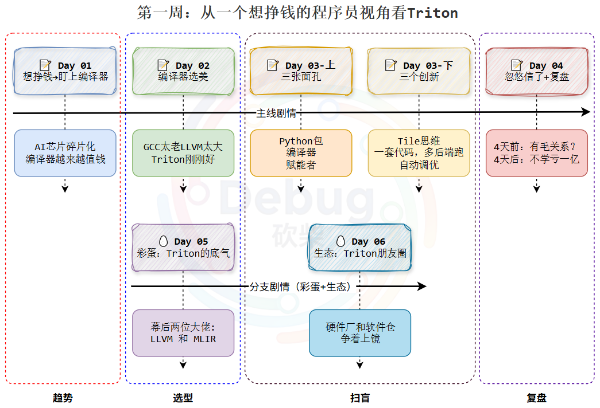

# 《刨根问底 Triton 编译器》 - 图解一个真实AI编译器的五脏六腑

**😫 问题1：为什么 会有 这个系列？** 作为一个程序猿，很想瞅瞅一个 “活生生” 的编译器的运转细节。

**😫 问题2：为什么 要写 这个系列？** 因为 AI 芯片越多，编译器这玩意儿就越值钱，写它有前途。

**🔪 拿谁下手？我选的是：OpenAI 开源的 Triton**——一个AI编译器，够新、够热、源码够典型，正好拿来开刀。

这个系列不讲虚的，每周会选一个小点切入——可能是一行代码、一条命令，也可能是一个文件。从这些最具体的细节下手，一步步摸进 Triton 的源码深处，把编译器的老底扒个底掉儿。🔍

下面就是每周要干的事：👇

> **规划：** 10周 = 4卷，由浅入深。

行了，废话不多说，刨根问底，走起...

---

## [开篇词：不啃龙书，10 周如何把 Triton 编译器扒了个底掉儿？](https://mp.weixin.qq.com/s/1_xwYX0nVzXBsskGNw39mA)

## 📜 第一卷：Triton 价值破局 —— 为什么学？

> **📖 这卷讲啥：** 先把你忽悠瘸——不对，忽悠信——**AI时代，编译器这东西真值得学**。用趋势“吓唬”你，用痛点“扎”你心，再用案例“勾引”你。总之让觉得**浪费几周时间，👀瞅瞅一个活生生的编译器的“五脏六腑”，这买卖不亏**。代码基本不细讲（毕竟，用不到的东西，提前说了都是浪费你我的时间），纯纯心智按摩。

### 🗓️ [第一周：【价值破局】2026玩透OpenAI的Triton，等于2014年All in移动互联网](https://mp.weixin.qq.com/s/A3P8kqzX2nd4XQvAVpML5g)

> **🌬️ 时代风口：** 你可能好奇：一个好好的程序员，不研究编程语言，却研究上编译器了，是不是有点不务正业？编译器到底有啥用？这周不写代码，专治"**编译器跟我有啥关系**"这个病。4天（主线）给你“洗个脑”——让你觉得AI时代，不学编译器简直亏了一个小目标。

- [📝 Day 01：一个想挣钱的程序猿：为啥放着算法不卷，盯上编译器了？](https://mp.weixin.qq.com/s/Lq-6EEiPIa8CRFgmRYPA2Q)
- [📝 Day 02：编译器"选美"：GCC / Clang / Triton，到底翻谁的牌子？](https://mp.weixin.qq.com/s/fuH4b16aFf-B5ZqdDK60GA)
- [📝 Day 03：人人都说 Triton 牛，凭啥？（上 · 三张面孔认识它）- 待更新](https://mp.weixin.qq.com/s/1_xwYX0nVzXBsskGNw39mA)
- [📝 Day 03：人人都说 Triton 牛，凭啥？（下 · 三个创新贼值钱）- 待更新](https://mp.weixin.qq.com/s/1_xwYX0nVzXBsskGNw39mA)
- [📝 Day 04：4天前：编译器跟我有毛关系？4天后：不学Triton感觉亏了一个亿 - 待更新](https://mp.weixin.qq.com/s/1_xwYX0nVzXBsskGNw39mA)
- [🥚 Day 05："选美冠军" Triton 的底气：幕后两位"大佬"终于藏不住了- 待更新](https://mp.weixin.qq.com/s/1_xwYX0nVzXBsskGNw39mA)
- [🥚 Day 06：两位"大佬"只是开胃菜——Triton 的朋友圈里全是硬核玩家 - 待更新](https://mp.weixin.qq.com/s/1_xwYX0nVzXBsskGNw39mA)

速览，一图胜千言：

---

## 📜 第二卷：Triton变形记 —— 编译器怎么干活？

> **📖 这卷干啥：** 不整虚的，直接从宏观到微观，从你写的Python到GPU最终听懂的话，像破案一样——不对，像看**热闹**一样，把Triton编译器从Python到GPU的"变形"全过程捋一遍。不保证你全会，保证你看了不困。
>
> **🚩 立个Flag：** 将一段代码作为整体切入点，花四周时间，不干啥，就带你瞅瞅，一个活生生的编译器，到底是怎么一步步把编译、执行整条线干完的。
>
> **🗺️ 本卷主线：** 宏观全景（第2周：导览图→代码蜕变全流程认知）→ compile源码（第3周：JITFunction.run → _do_compile → compile）→ run二进制（第4周：cubin→GPU launch）→ 全栈串联（第5周：💾~/.triton→文件视角下的编译器）

---

### [📝 第二卷的引导篇]()

### 🗓️ 第二周：【代码蜕变】一段Python代码的“西游记”：你敲下代码，Triton在背地里偷偷忙活了啥？

- [📝 Day 01：刨根问底一小段在triton里"脱胎换骨"的Python代码，刨谁？- 待更新](https://mp.weixin.qq.com/s/1_xwYX0nVzXBsskGNw39mA)
- [📝 Day 02：待更新](https://mp.weixin.qq.com/s/1_xwYX0nVzXBsskGNw39mA)
- [📝 Day 03：待更新](https://mp.weixin.qq.com/s/1_xwYX0nVzXBsskGNw39mA)
- [📝 Day 04：待更新](https://mp.weixin.qq.com/s/1_xwYX0nVzXBsskGNw39mA)
- [📝 Day 05：待更新](https://mp.weixin.qq.com/s/1_xwYX0nVzXBsskGNw39mA)
- [📝 Day 06：待更新](https://mp.weixin.qq.com/s/1_xwYX0nVzXBsskGNw39mA)
- [📝 Day 07：待更新](https://mp.weixin.qq.com/s/1_xwYX0nVzXBsskGNw39mA)

---

### 🗓️ 第三周：【编译链路】Triton用一个@jit装饰器，就能让Python代码“变形”？刨开JITFunction给你看

- [📝 Day 01：揭秘 Triton 编译机制：为什么 JITFunction 是理解它的核心地图？- 待更新](https://mp.weixin.qq.com/s/1_xwYX0nVzXBsskGNw39mA)
- [📝 Day 02：待更新](https://mp.weixin.qq.com/s/1_xwYX0nVzXBsskGNw39mA)
- [📝 Day 03：待更新](https://mp.weixin.qq.com/s/1_xwYX0nVzXBsskGNw39mA)
- [📝 Day 04：待更新](https://mp.weixin.qq.com/s/1_xwYX0nVzXBsskGNw39mA)
- [📝 Day 05：待更新](https://mp.weixin.qq.com/s/1_xwYX0nVzXBsskGNw39mA)
- [📝 Day 06：待更新](https://mp.weixin.qq.com/s/1_xwYX0nVzXBsskGNw39mA)
- [📝 Day 07：待更新](https://mp.weixin.qq.com/s/1_xwYX0nVzXBsskGNw39mA)

---

### 🗓️ 第四周：【执行引擎】编译产物在硬盘里吃灰？Triton：等着，我送它去GPU上跑

- [📝 Day 01：凭啥@triton.jit编译完不能歇会？Triton执行机制帮你解惑 - 待更新](https://mp.weixin.qq.com/s/1_xwYX0nVzXBsskGNw39mA)
- [📝 Day 02：待更新](https://mp.weixin.qq.com/s/1_xwYX0nVzXBsskGNw39mA)
- [📝 Day 03：待更新](https://mp.weixin.qq.com/s/1_xwYX0nVzXBsskGNw39mA)
- [📝 Day 04：待更新](https://mp.weixin.qq.com/s/1_xwYX0nVzXBsskGNw39mA)
- [📝 Day 05：待更新](https://mp.weixin.qq.com/s/1_xwYX0nVzXBsskGNw39mA)
- [📝 Day 06：待更新](https://mp.weixin.qq.com/s/1_xwYX0nVzXBsskGNw39mA)

---

### 🗓️ 第五周：【全栈串联】刨完代码，刨文件——一个.cubin文件的“前世今生”，藏着Triton的“全流程真相”

- [📝 Day 01：你以为Triton只改了你的代码？扒一扒它在硬盘里的"小动作"——缓存、哈希、加载一手抓 - 待更新](https://mp.weixin.qq.com/s/1_xwYX0nVzXBsskGNw39mA)
- [📝 Day 02：待更新](https://mp.weixin.qq.com/s/1_xwYX0nVzXBsskGNw39mA)
- [📝 Day 03：待更新](https://mp.weixin.qq.com/s/1_xwYX0nVzXBsskGNw39mA)
- [📝 Day 04：待更新](https://mp.weixin.qq.com/s/1_xwYX0nVzXBsskGNw39mA)
- [📝 Day 05：待更新](https://mp.weixin.qq.com/s/1_xwYX0nVzXBsskGNw39mA)
- [📝 Day 06：待更新](https://mp.weixin.qq.com/s/1_xwYX0nVzXBsskGNw39mA)

---

### [📝 第二卷的总结篇 - 待更新](https://mp.weixin.qq.com/s/1_xwYX0nVzXBsskGNw39mA)

---

## 📜 第三卷：剖析Triton —— 源码长啥样？

> **📖 这卷干啥：** 第二卷你看了 Triton 的"表演"——代码变形、吃灰了送上 GPU、留下了.cubin档案。**但这周，我们走进"后台"，翻开 Triton 的源码，看看那些表演是怎么被代码实现的。** 说白了，就是满足你的好奇心：第二卷看到的那一切，Triton 自己是怎么写出来的？
>
> **🚩 立个Flag：** 花两周时间，带你去看看 Triton 源码。当你看到 `runtime/jit.py` 里的 `JITFunction` 时，你会发现：**哦！原来第二卷学的 run() → _do_compile() → compile() 就在这里！**
>
> **🗺️ 本卷主线：** 仓库俯瞰（第6周：目录结构→组件职责）→ 构建系统（第7周：📦 pip install→CMake→LLVM）

---

### [📝 第三卷的引导篇]()

---

### 🗓️ 第六周：【源码剖析】刨根问底Triton仓库：看OpenAI如何"捏出"AI编译器的“五脏六腑”

- [📝 Day 01：20w行，26MB就捣鼓出一个AI编译器？看OpenAI如何"优雅"地写Triton - 待更新](https://mp.weixin.qq.com/s/1_xwYX0nVzXBsskGNw39mA)
- [📝 Day 02：待更新](https://mp.weixin.qq.com/s/1_xwYX0nVzXBsskGNw39mA)
- [📝 Day 03：待更新](https://mp.weixin.qq.com/s/1_xwYX0nVzXBsskGNw39mA)
- [📝 Day 04：待更新](https://mp.weixin.qq.com/s/1_xwYX0nVzXBsskGNw39mA)
- [📝 Day 05：待更新](https://mp.weixin.qq.com/s/1_xwYX0nVzXBsskGNw39mA)
- [📝 Day 06：待更新](https://mp.weixin.qq.com/s/1_xwYX0nVzXBsskGNw39mA)

---

### 🗓️ 第七周：【构建Triton】从install到build一条龙服务，瞅瞅Triton是如何被“造”出来的

- [📝 Day 01：安装Triton那些事儿：装一个Triton，能学会多少花活？——从pip install看构建系统全貌 - 待更新](https://mp.weixin.qq.com/s/1_xwYX0nVzXBsskGNw39mA)
- [📝 Day 02：待更新](https://mp.weixin.qq.com/s/1_xwYX0nVzXBsskGNw39mA)
- [📝 Day 03：待更新](https://mp.weixin.qq.com/s/1_xwYX0nVzXBsskGNw39mA)
- [📝 Day 04：待更新](https://mp.weixin.qq.com/s/1_xwYX0nVzXBsskGNw39mA)
- [📝 Day 05：待更新](https://mp.weixin.qq.com/s/1_xwYX0nVzXBsskGNw39mA)
- [📝 Day 06：待更新](https://mp.weixin.qq.com/s/1_xwYX0nVzXBsskGNw39mA)

---

### [📝 第三卷的总结篇 - 待更新](https://mp.weixin.qq.com/s/1_xwYX0nVzXBsskGNw39mA)

---

## 📜 第四卷：改造Triton —— 改哪里？怎么改？

> **📖 这卷干啥：** 这卷不玩儿虚的了。前三卷你搁那儿光看不练，跟追剧似的，这第四卷直接把你踹进战场——两个小任务：加个后端、添个算子，带你亲手把Triton的源码按在地上摩擦一遍。从头到尾，从前到后，改完你就不是"用过"Triton的人了，是"改过"Triton的人，这俩头衔含金量能一样吗？顺手还把代码生成那块给啃了——本来应该塞第二卷的，但那时候讲，你听着像天书，我讲着像对牛弹琴，纯属互相伤害。现在时机到了，开整。
>
> **🚩 立个Flag：** 前七周你是Triton的读者，这周开始你升级成作者了。打算再花三周，带你亲手给Triton添砖加瓦。
>
> **🗺️ 本卷主线：** 后端扩展（第8周：CPU后端实战）→ 代码生成（第9周：🧩 MLIR Pass与IR降级）→ 全栈贯通（第10周：添加gather算子）。三周走完，你就是Triton的贡献者了——虽然目前只有你自己知道。

---

### [📝 第四卷的引导篇 - 待更新](https://mp.weixin.qq.com/s/1_xwYX0nVzXBsskGNw39mA)

---

### 🗓️ 第八周：【后端扩展】源码读了，构建会了，该“干一票”了——给Triton加个CPU后端

- [📝 Day 01：剖析Triton后端实现（上）：先看官方标准答案——一套代码，怎么跑多硬件？ - 待更新](https://mp.weixin.qq.com/s/1_xwYX0nVzXBsskGNw39mA)
- [📝 Day 02：待更新](https://mp.weixin.qq.com/s/1_xwYX0nVzXBsskGNw39mA)
- [📝 Day 03：待更新](https://mp.weixin.qq.com/s/1_xwYX0nVzXBsskGNw39mA)
- [📝 Day 04：待更新](https://mp.weixin.qq.com/s/1_xwYX0nVzXBsskGNw39mA)
- [📝 Day 05：待更新](https://mp.weixin.qq.com/s/1_xwYX0nVzXBsskGNw39mA)
- [📝 Day 06：待更新](https://mp.weixin.qq.com/s/1_xwYX0nVzXBsskGNw39mA)
- [📝 Day 07：待更新](https://mp.weixin.qq.com/s/1_xwYX0nVzXBsskGNw39mA)

---

### 🗓️ 第九周：【代码生成】一段代码的“降维打击”：x+y要“换装四次”才能让GPU认识？Triton你累不累

- [📝 Day 01：学Triton代码生成，凭啥要先过MLIR这一关？——从官方的Toy编译器说起 - 待更新](https://mp.weixin.qq.com/s/1_xwYX0nVzXBsskGNw39mA)
- [📝 Day 02：待更新](https://mp.weixin.qq.com/s/1_xwYX0nVzXBsskGNw39mA)
- [📝 Day 03：待更新](https://mp.weixin.qq.com/s/1_xwYX0nVzXBsskGNw39mA)
- [📝 Day 04：待更新](https://mp.weixin.qq.com/s/1_xwYX0nVzXBsskGNw39mA)
- [📝 Day 05：待更新](https://mp.weixin.qq.com/s/1_xwYX0nVzXBsskGNw39mA)
- [📝 Day 06：待更新](https://mp.weixin.qq.com/s/1_xwYX0nVzXBsskGNw39mA)

---

### 🗓️ 第十周：【全栈贯通】代码读了，构建会了，后端加了——最后一步：给Triton加函数画句号

- [📝 Day 01：Triton加个函数那点事儿（上）：从一个error开始，徒手"生造"一个gather函数——方案→API→IR→Pass→空壳 - 待更新](https://mp.weixin.qq.com/s/1_xwYX0nVzXBsskGNw39mA)
- [📝 Day 02：待更新](https://mp.weixin.qq.com/s/1_xwYX0nVzXBsskGNw39mA)
- [📝 Day 03：待更新](https://mp.weixin.qq.com/s/1_xwYX0nVzXBsskGNw39mA)
- [📝 Day 04：待更新](https://mp.weixin.qq.com/s/1_xwYX0nVzXBsskGNw39mA)
- [📝 Day 05：待更新](https://mp.weixin.qq.com/s/1_xwYX0nVzXBsskGNw39mA)

### [📝 第四卷的总结篇 - 待更新](https://mp.weixin.qq.com/s/1_xwYX0nVzXBsskGNw39mA)

---

## [刨根问底Triton——大结局：你已经是Triton的Contributor了 - 待更新](https://mp.weixin.qq.com/s/1_xwYX0nVzXBsskGNw39mA)
